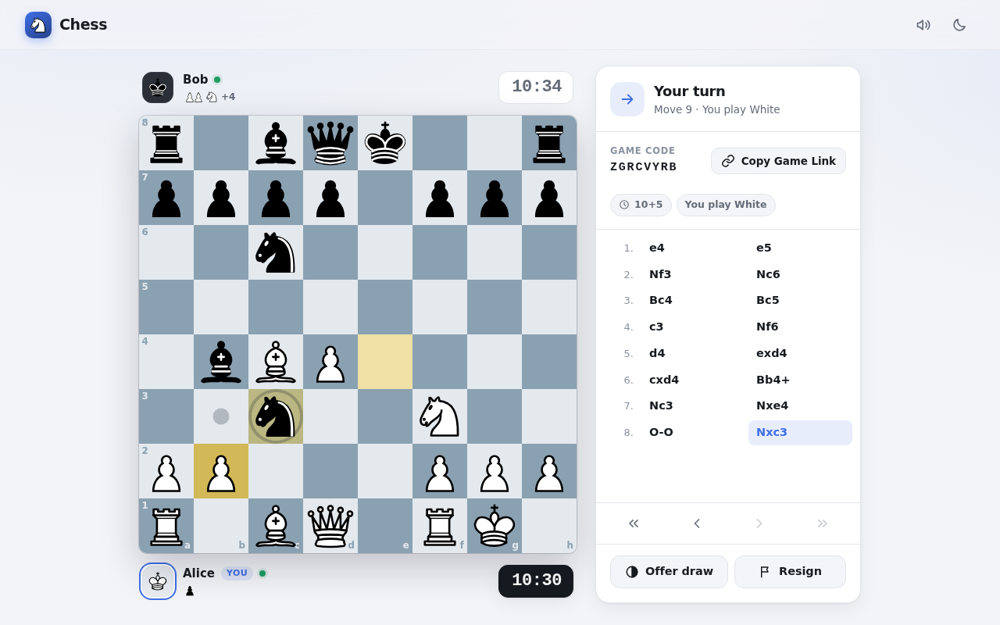
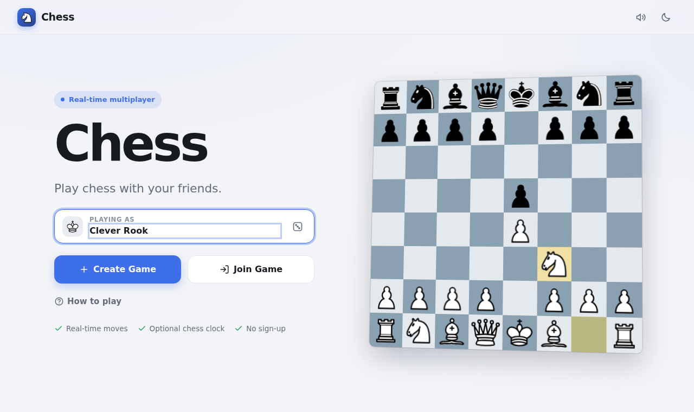
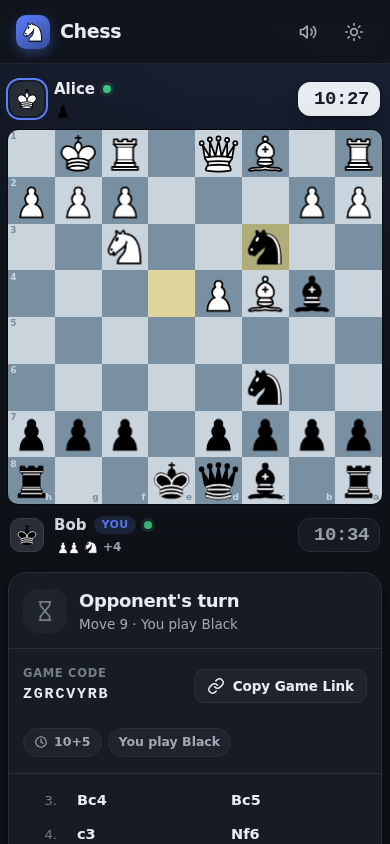

# Chess — play chess with your friends

A real-time multiplayer chess web app built with **ASP.NET Core**, **SignalR** and **SQLite**.
Create a game, send the link to a friend, and play in the browser on desktop, tablet or phone.



## Features

- **Complete chess rules**, enforced on the server: legal moves for every piece, check, checkmate,
  stalemate, castling, en passant, promotion (with a piece picker), threefold repetition,
  the fifty-move rule and insufficient material.
- **Real-time multiplayer** over SignalR (WebSockets with automatic fallbacks):
  shareable game links/codes, automatic White/Black assignment, spectators,
  and automatic reconnection that resumes your seat.
- **Chess clocks** (1+0 up to 15+10, or no clock), counted by the server; flag falls are detected even
  if nobody moves. Timeout against a lone king (or king + minor piece) is a draw.
- **Game actions**: resign (with confirmation), abort before the first moves, draw offers
  (accept/decline), rematch with colours swapped, and claiming a game when the opponent left.
- **Polished UI**: drag-and-drop or click-to-move, legal-move hints, last-move/check highlighting,
  animated moves and captures, move history with position review (← / → keys),
  captured pieces and material balance, toasts, result screen, dark/light theme and subtle
  synthesised sound effects with a mute toggle.

| Home | Phone (dark mode) |
| --- | --- |
|  |  |

## Running it in Visual Studio

**Requirements:** Visual Studio 2026 (or later) with the *ASP.NET and web development* workload, which
includes the .NET 10 SDK. (Using Visual Studio 2022 / .NET 8? See [below](#using-net-8--visual-studio-2022).)

1. Open `Chess.sln`.
2. Make sure **Chess.Web** is the startup project (right-click → *Set as Startup Project*).
3. Press **F5** (or Ctrl+F5). The `https` launch profile opens `https://localhost:7069`.
   Accept the prompt to trust the ASP.NET Core development certificate the first time.

The SQLite database (`src/Chess.Web/App_Data/chess.db`) is created and migrated automatically on
startup, so there is nothing else to set up.

### Playing against yourself

Open the game link in a **second tab or window** — each tab is treated as a separate player, so you
can play both sides from one browser. (A private/incognito window works too.)
Opening the link in a third tab makes you a spectator.

### From the command line

```bash
dotnet run --project src/Chess.Web     # https://localhost:7069 and http://localhost:5100
dotnet test                            # engine + web tests
```

If the browser doesn't trust the local HTTPS certificate, run `dotnet dev-certs https --trust` once,
or use `dotnet run --project src/Chess.Web --launch-profile http`.

## Configuration

Everything has sensible defaults in `src/Chess.Web/appsettings.json`; nothing is required.
Any value can be overridden with environment variables (use `__` for nesting, e.g.
`Chess__ReconnectGracePeriod=00:00:30`).

| Setting | Default | Meaning |
| --- | --- | --- |
| `ConnectionStrings:Chess` | `Data Source=App_Data/chess.db` | SQLite database. Relative paths are resolved against the app folder. |
| `Chess:ReconnectGracePeriod` | `00:01:00` | How long a disconnected player has before the opponent may claim the game. |
| `Chess:ClockCheckInterval` | `00:00:00.200` | How often running clocks are checked for flag falls. |
| `Chess:IdleGameEvictionAfter` | `00:30:00` | Games nobody is connected to are unloaded from memory after this (they stay in the database). |
| `Chess:EvictionSweepInterval` | `00:01:00` | How often idle games are looked for. |
| `Chess:MaxPlayerNameLength` | `24` | Longer display names are truncated. |
| `Chess:GameCreationPerMinuteLimit` | `20` | Rate limit for creating games, per client IP. |

## Architecture

```
Chess.sln
├─ src/Chess.Engine        Pure C# chess rules (no ASP.NET dependencies)
├─ src/Chess.Web           ASP.NET Core app: pages, API, SignalR hub, services, data, frontend
├─ tests/Chess.Engine.Tests
└─ tests/Chess.Web.Tests
```

### Chess.Engine

An immutable `Position` generates legal moves (pseudo-legal generation + "does this leave my king in
check?" filtering) and applies moves. `ChessGame` holds the move history, SAN notation and decides
when the game is over. `Fen` and `San` handle notation. Move generation is verified with the standard
**perft** node counts (start position, "Kiwipete" and others), which exercise castling, en passant,
promotions and pins exhaustively.

### Chess.Web

| Folder | Responsibility |
| --- | --- |
| `Domain/` | `GameSession` — the authoritative live game: seats, turn rules, clock, draw offers, rematch, abandonment. Pure logic, no I/O. Also `ChessClock`, `GameCode`, `SeatToken`. |
| `Services/` | `GameService` orchestrates commands (lock → apply rule → persist → broadcast). `GameRegistry` keeps live sessions in memory and loads/unloads them. Background services enforce clocks and evict idle games. |
| `Hubs/` | `GameHub` — the SignalR endpoint. Thin: validates input and delegates to `GameService`. |
| `Endpoints/` | Minimal API: `POST /api/games` (create), `GET /api/games/{code}` (look up). |
| `Data/` | EF Core `ChessDbContext`, entities (`Games`, `Players`, `Moves`), migrations and `GameRepository`. |
| `Contracts/` | DTOs sent over the wire. |
| `Pages/` | Razor Pages: home, game, error pages. |
| `wwwroot/` | Frontend: plain ES modules and CSS, no build step. `js/board` (board component), `js/game` (game screen), `js/home`, `js/common`. |

### How multiplayer works

1. **Create:** the home page calls `POST /api/games`. The server creates the game, seats the creator
   and returns the game code plus a secret **seat token**. The browser stores the token and opens
   `/game/{code}`.
2. **Join:** the game page connects to the SignalR hub (`/hubs/game`) and calls `JoinGame`. The server
   either resumes the seat that matches the tab's token, gives the free seat to a newcomer (which
   starts the game automatically), or makes the visitor a spectator. A seat can never be taken
   without its token, so a third person cannot steal the second player's slot.
3. **Move:** the client sends a move in UCI form (e.g. `e2e4`). The server checks that the connection
   owns the seat, that it is that player's turn, that the clock has not run out, and that the move is
   legal — then updates the state, saves it to SQLite, and **broadcasts a complete snapshot** to
   everyone in the game's SignalR group. The client shows the move instantly for responsiveness and
   rolls back if the server rejects it.
4. **Sync:** every snapshot carries a version number, so stale or duplicate messages are ignored.
   Clients never compute legality; the server even sends the list of legal moves for highlighting.
5. **Reconnect:** SignalR reconnects automatically; the client then re-joins with its seat token and
   receives the current snapshot. Closing the tab and reopening the link also works: tokens are kept
   per tab (`sessionStorage`) and remembered per browser (`localStorage`) for seats nobody is using.
   The opponent sees a disconnected indicator and, after the grace period, may claim the win or a draw.
6. **Clocks:** time is measured only on the server. Clients receive remaining times with each
   snapshot and count down locally for display; a background service ends the game when a flag falls.

Games are processed one command at a time per game (a per-session async lock), so simultaneous
actions — e.g. both players clicking *Rematch* — are handled safely. Many games run independently.

### Security notes

- The server is authoritative for moves, turns, clocks and results; the client cannot change state
  except through validated hub commands, and every command acts only on the caller's own seat.
- Seat tokens are 256-bit random values; only their SHA-256 hash is stored.
- Names are sanitised and always rendered as text. Game creation is rate limited.
- Security headers are sent on every response, including a strict Content-Security-Policy outside
  Development.

## Database

SQLite via EF Core. Tables: `Games` (status, settings, current position, clocks, result),
`Players` (seat colour, display name, token hash) and `Moves` (UCI, SAN, resulting FEN, clock readings).
Migrations are applied automatically at startup. To add a migration:

```bash
dotnet tool restore
dotnet ef migrations add <Name> --project src/Chess.Web --output-dir Data/Migrations
```

## Tests

```bash
dotnet test
```

- **Chess.Engine.Tests** — perft suites, castling/en passant/promotion edge cases, check, checkmate,
  stalemate, draws, FEN and SAN.
- **Chess.Web.Tests** — `GameSession` rules (seats, turns, clocks, offers, rematch, abandonment) and
  integration tests that host the real app in memory and drive it with real SignalR clients:
  joining, broadcasting, rejected moves, spectators, reconnection, server-enforced timeouts (with a
  fake clock), rematches, isolation between games and reloading games from the database.

## Using .NET 8 / Visual Studio 2022

The solution targets .NET 10 (the current LTS). To run it on .NET 8 instead:

1. In `Directory.Build.props`, set `<TargetFramework>net8.0</TargetFramework>`.
2. In `Directory.Packages.props`, set the `Microsoft.EntityFrameworkCore.Sqlite`,
   `Microsoft.EntityFrameworkCore.Design`, `Microsoft.AspNetCore.Mvc.Testing` and
   `Microsoft.AspNetCore.SignalR.Client` versions to a concrete 8.0 release, e.g. `8.0.31`
   (central package management does not accept wildcards such as `8.0.*`).
3. In `src/Chess.Web/Program.cs`, replace `app.MapStaticAssets();` with `app.UseStaticFiles();` and
   remove `.WithStaticAssets()` (static asset endpoints were introduced in .NET 9).

These steps were verified: the solution builds without warnings and all tests pass on .NET 8.

## Limitations

- Players are anonymous (no accounts), so there is no rating/ranked mode or game history page.
- Live games are held in the memory of a single server process, so the app is meant to run as one
  instance (a scale-out setup would need a SignalR backplane and shared game ownership).
- If the server restarts during a timed game, the time that passed while it was down is not charged.
- Premoves and conditional moves are not supported.

## Credits

Chess pieces by Colin M.L. Burnett (CC BY-SA 3.0). See [THIRD-PARTY-NOTICES.md](THIRD-PARTY-NOTICES.md).
